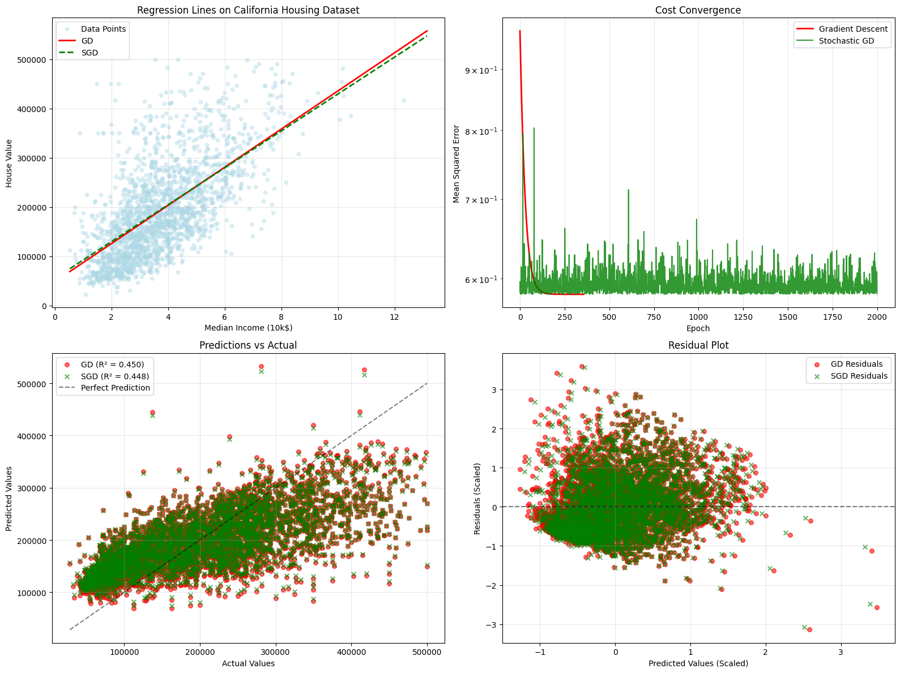

# Linear Regression from Scratch

This project provides a from-scratch implementation of a linear regression model in Python. It demonstrates and compares two optimization algorithms: Batch Gradient Descent (GD) and Stochastic Gradient Descent (SGD). The model is trained on the California Housing dataset to predict median house values based on median income.

## Project Overview

The core of this project is the Jupyter Notebook `main.ipynb`, which walks through the entire process of building, training, and evaluating a linear regression model.

### Key Features:
*   **Pure Python/NumPy Implementation**: The regression fitters are built from scratch using NumPy for numerical operations.
*   **Two Fitter Implementations**:
    1.  `GradientDescentFitter`: A classic batch Gradient Descent that processes the entire dataset in each epoch.
    2.  `StochasticGradientDescentFitter`: An SGD implementation that updates model parameters for each individual data point.
*   **Data Preprocessing**: Implements standardization (z-score normalization) to improve gradient descent convergence and performance.
*   **Model Evaluation**: Uses Mean Squared Error (MSE) and R-squared (R²) to evaluate model performance on a test set.
*   **In-depth Visualization**: Generates a comprehensive set of plots to analyze the model's behavior, including regression lines, cost convergence, prediction accuracy, and residual analysis.

## Dataset

The model is trained on the **California Housing dataset**. Specifically, it uses the `median_income` feature to predict the `median_house_value`. The data is loaded directly from its source in the notebook.

-   **Source**: [ageron/handson-ml2/datasets/housing](https://github.com/ageron/handson-ml2/tree/master/datasets/housing)

## How to Run

1.  **Prerequisites**: Ensure you have Python and the following libraries installed:
    *   NumPy
    *   Pandas
    *   Matplotlib

2.  **Execution**: Open and run the `main.ipynb` notebook in a Jupyter environment. The notebook will handle downloading the data, training the models, and generating the output visualizations.

## Results and Analysis

The models are trained and evaluated, with the results visualized in a multi-panel plot (`output.png`).

### Explanation of Plots:

1.  **Regression Lines on California Housing Dataset (Top-Left)**: This plot shows the original data points (light blue) with the regression lines learned by both Gradient Descent (red, solid) and Stochastic Gradient Descent (green, dashed). It provides a clear visual of how well each model fits the overall data trend.

2.  **Cost Convergence (Top-Right)**: This plot illustrates the change in Mean Squared Error (the "cost") over each training epoch. The smooth red line for GD shows steady convergence, while the noisy green line for SGD reflects the parameter updates on single data points, though it also converges to a similar minimum.

3.  **Predictions vs Actual (Bottom-Left)**: This scatter plot compares the model's predicted house values against the actual values for the test set. The points clustering around the dashed "Perfect Prediction" line indicate the model's accuracy. The R² scores for both GD (0.450) and SGD (0.448) show that the model explains about 45% of the variance in house prices.

4.  **Residual Plot (Bottom-Right)**: This plot shows the residuals (the difference between actual and predicted values) against the predicted values. A random scatter of points around the horizontal zero-line suggests that the model's errors are unbiased, which is a good sign for a linear model.